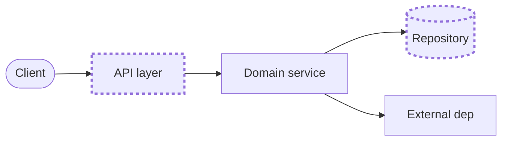

# ARCHITECTURE — <PROJECT NAME>

> **DRAFT — awaiting engineer validation.** Technical truth (how it's built) — it **realizes the validated
> `PRD.md`**: one level below it in the hierarchy (equal-weight baseline, not lesser in importance).
> Decisions here generally trace to the FR/NFR/régua they serve; the product *what/why* is referenced, not
> duplicated. A living document — update it when a decision closes; keep discarded alternatives.

## System context — level, scale & operability
The application's **level** (e.g. prototype/PoC · MVP · production) and the **scale/operability** it must meet —
**realizing the PRD's NFRs** (load, SLA, scalability, operability), referenced by ID, not restated. Let the
level **size** everything below: the deployment / delivery / infrastructure / tooling shape is designed
**proportional to it — only what this project actually needs**, and skipped where it doesn't fit (a
prototype may be a single sentence). The **architecture style** (if the project has one) is captured in the
Overview or an ADR **only if it fits**. Conventions, design patterns and coding best practices are **not**
here (they go in the user's ambient conventions).

## Overview
The shape of the solution in a few sentences.

### System diagram (container + seams)
One whole-project view a newcomer orients on — **container/component altitude, not code-level**:
external actors, the main components/layers, data stores, external deps. **Mark the seams** (where
behaviour and unit tests intercept the system) — that is what makes this diagram load-bearing, not decoration.
Use **Mermaid** (text diffs in git; no binary assets). Keep the overview itself to **one** container view,
and **validate it with the user** — the whole-system picture is theirs to confirm whatever
the project's complexity. The régua wins if a truthful diagram gets expensive — prose beats a stale picture.

### Additional diagrams (as needed — often none)
Beyond the container view, add a more granular diagram **wherever one would carry information the overview
can't** — a hot path the régua cares about, a tricky interaction, a state machine. How many is a judgment
call on the project's complexity (frequently zero or one), **validated with the user** —
there is **no fixed cap and no quota**. The discipline is the régua's, not a number: each diagram must earn
its place and stay truthful (prose beats a stale or decorative picture), and finer per-scenario sequences
live in the phase PRDs / Gherkin, not here.

## Seams
Where behavior is intercepted for testing (prefer existing, highest, fewest). These are what the
behaviour and unit tests reference.

## Components / layers
The modules/layers and their responsibilities.

## Structure (repository layout)
Where things physically live — the directory / module / script layout (and, for a multi-repo system, which
repo owns what). For an existing codebase, **map what's there and sanity-check it makes sense**; for a new
one, **propose the initial layout**. Either way it is **validated with the user** — the
shape of the repo is a decision, not an accident. Folder/module altitude, not a file-by-file dump.

## Key decisions (ADRs)
Index of closed decisions → link to each ADR in the repo's ADRs directory. Each ADR names the discarded
alternative and why.

## Discarded alternatives
| Considered | Rejected because |
|---|---|

## Open questions
Pendências to resolve before or during the affected phase.
